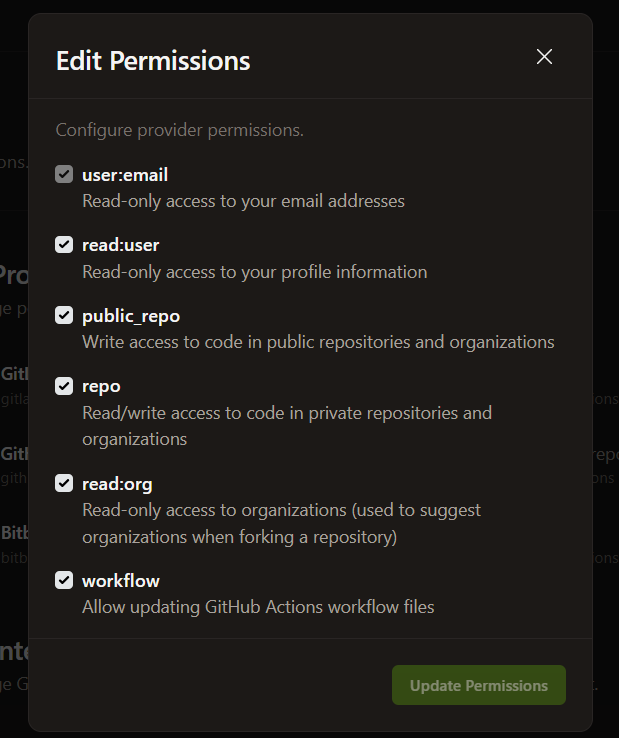

[](https://gitpod.io/#https://github.com/uwidcit/flaskmvc)
<a href="https://render.com/deploy?repo=https://github.com/uwidcit/flaskmvc">
  
</a>


# Flask MVC Template
A template for flask applications structured in the Model View Controller pattern [Demo](https://dcit-flaskmvc.herokuapp.com/). [Postman Collection](https://documenter.getpostman.com/view/583570/2s83zcTnEJ)


# Dependencies
* Python3/pip3
* Packages listed in requirements.txt

# Installing Dependencies
```bash
$ pip install -r requirements.txt
```

# Configuration Management


Configuration information such as the database url/port, credentials, API keys etc are to be supplied to the application. However, it is bad practice to stage production information in publicly visible repositories.
Instead, all config is provided by a config file or via [environment variables](https://linuxize.com/post/how-to-set-and-list-environment-variables-in-linux/).

## In Development

When running the project in a development environment (such as gitpod) the app is configured via default_config.py file in the App folder. By default, the config for development uses a sqlite database.

default_config.py
```python
SQLALCHEMY_DATABASE_URI = "sqlite:///temp-database.db"
SECRET_KEY = "secret key"
JWT_ACCESS_TOKEN_EXPIRES = 7
ENV = "DEVELOPMENT"
```

These values would be imported and added to the app in load_config() function in config.py

config.py
```python
# must be updated to inlude addtional secrets/ api keys & use a gitignored custom-config file instad
def load_config():
    config = {'ENV': os.environ.get('ENV', 'DEVELOPMENT')}
    delta = 7
    if config['ENV'] == "DEVELOPMENT":
        from .default_config import JWT_ACCESS_TOKEN_EXPIRES, SQLALCHEMY_DATABASE_URI, SECRET_KEY
        config['SQLALCHEMY_DATABASE_URI'] = SQLALCHEMY_DATABASE_URI
        config['SECRET_KEY'] = SECRET_KEY
        delta = JWT_ACCESS_TOKEN_EXPIRES
...
```

## In Production

When deploying your application to production/staging you must pass
in configuration information via environment tab of your render project's dashboard.


# Flask Commands

wsgi.py is a utility script for performing various tasks related to the project. You can use it to import and test any code in the project. 
You just need create a manager command function, for example:

```python
# inside wsgi.py

user_cli = AppGroup('user', help='User object commands')

@user_cli.cli.command("create-user")
@click.argument("username")
@click.argument("password")
def create_user_command(username, password):
    create_user(username, password)
    print(f'{username} created!')

app.cli.add_command(user_cli) # add the group to the cli

```

Then execute the command invoking with flask cli with command name and the relevant parameters

```bash
$ flask user create bob bobpass
```


# Running the Project

_For development run the serve command (what you execute):_
```bash
$ flask run
```

_For production using gunicorn (what the production server executes):_
```bash
$ gunicorn wsgi:app
```

# Deploying
You can deploy your version of this app to render by clicking on the "Deploy to Render" link above.

# Initializing the Database
When connecting the project to a fresh empty database ensure the appropriate configuration is set then file then run the following command. This must also be executed once when running the app on heroku by opening the heroku console, executing bash and running the command in the dyno.

```bash
$ flask init
```

# Database Migrations
If changes to the models are made, the database must be'migrated' so that it can be synced with the new models.
Then execute following commands using manage.py. More info [here](https://flask-migrate.readthedocs.io/en/latest/)

```bash
$ flask db init
$ flask db migrate
$ flask db upgrade
$ flask db --help
```

# Testing

## Unit & Integration
Unit and Integration tests are created in the App/test. You can then create commands to run them. Look at the unit test command in wsgi.py for example

```python
@test.command("user", help="Run User tests")
@click.argument("type", default="all")
def user_tests_command(type):
    if type == "unit":
        sys.exit(pytest.main(["-k", "UserUnitTests"]))
    elif type == "int":
        sys.exit(pytest.main(["-k", "UserIntegrationTests"]))
    else:
        sys.exit(pytest.main(["-k", "User"]))
```

You can then execute all user tests as follows

```bash
$ flask test user
```

You can also supply "unit" or "int" at the end of the comand to execute only unit or integration tests.

You can run all application tests with the following command

```bash
$ pytest
```

## Test Coverage

You can generate a report on your test coverage via the following command

```bash
$ coverage report
```

You can also generate a detailed html report in a directory named htmlcov with the following comand

```bash
$ coverage html
```

# Troubleshooting

## Views 404ing

If your newly created views are returning 404 ensure that they are added to the list in main.py.

```python
from App.views import (
    user_views,
    index_views
)

# New views must be imported and added to this list
views = [
    user_views,
    index_views
]
```

## Cannot Update Workflow file

If you are running into errors in gitpod when updateding your github actions file, ensure your [github permissions](https://gitpod.io/integrations) in gitpod has workflow enabled 

## Database Issues

If you are adding models you may need to migrate the database with the commands given in the previous database migration section. Alternateively you can delete you database file.

# Employer Commands Group
employer_cli = AppGroup('employer', help='Employer-related commands')

@employer_cli.command("create", help="Creates a new employer")
@click.argument("name")
@click.argument("company_name")
@click.argument("email")
@click.argument("phone_number")
@click.argument("address")
@with_appcontext
def create_employer_command(name, company_name, email, phone_number, address):
    create_employer(name, company_name, email, phone_number, address)
    print(f"Employer {name} created successfully.")

Command to create employer:
flask employer create <name> <company_name> <email> <phone_number> <address>


@employer_cli.command("update", help="Updates an employer's details")
@click.argument("employer_id")
@click.argument("name")
@click.argument("company_name")
@click.argument("email")
@click.argument("phone_number")
@click.argument("address")
@with_appcontext
def update_employer_command(employer_id, name, company_name, email, phone_number, address):
    update_employer(employer_id, name, company_name, email, phone_number, address)
    print(f"Employer {name} updated successfully.")

Command to update an employer:
flask employer update <employer_id> <name> <company_name> <email> <phone_number> <address>


@employer_cli.command("delete", help="Deletes an employer")
@click.argument("employer_id")
@with_appcontext
def delete_employer_command(employer_id):
    delete_employer(employer_id)
    print(f"Employer {employer_id} deleted successfully.")

Command to delete an employer:
flask employer delete <employer_id>


@employer_cli.command("list", help="Lists all employers")
@with_appcontext
def list_employers_command():
    employers = get_all_employers()
    for employer in employers:
        print(employer)

app.cli.add_command(employer_cli)

Command to list all employers:
flask employer list

# Job Posting Commands Group
job_cli = AppGroup('job', help='Job-related commands')

@job_cli.command("create", help="Creates a new job posting")
@click.argument("title")
@click.argument("description")
@click.argument("location")
@click.argument("category")
@click.argument("employer_id")
@with_appcontext
def create_job_command(title, description, location, category, employer_id):
    create_job_posting(title, description, location, category, employer_id)
    print(f"Job '{title}' created successfully.")

Command to create a job posting:
flask job create <title> <description> <location> <category> <employer_id>


@job_cli.command("update", help="Updates a job posting")
@click.argument("job_id")
@click.argument("title")
@click.argument("description")
@click.argument("location")
@click.argument("category")
@click.argument("employer_id")
@with_appcontext
def update_job_command(job_id, title, description, location, category, employer_id):
    update_job_posting(job_id, title, description, location, category, employer_id)
    print(f"Job {job_id} updated successfully.")

Command to update a job posting:
flask job update <job_id> <title> <description> <location> <category> <employer_id>


@job_cli.command("delete", help="Deletes a job posting")
@click.argument("job_id")
@with_appcontext
def delete_job_command(job_id):
    delete_job_posting(job_id)
    print(f"Job {job_id} deleted successfully.")

@job_cli.command("list", help="Lists all job postings")
@with_appcontext
def list_jobs_command():
    jobs = get_all_job_postings()
    for job in jobs:
        print(job)

Command to delete a job posting:
flask job delete <job_id>


@job_cli.command("list-category", help="Lists jobs by category")
@click.argument("category")
@with_appcontext
def list_jobs_by_category_command(category):
    jobs = get_job_postings_by_category(category)
    for job in jobs:
        print(job)

Command to list job postings by category:
flask job list-category <category>


@job_cli.command("list-employer", help="Lists jobs by employer")
@click.argument("employer_id")
@with_appcontext
def list_jobs_by_employer_command(employer_id):
    jobs = get_job_postings_by_employer(employer_id)
    for job in jobs:
        print(job)

app.cli.add_command(job_cli)

Command to list job postings by employer:
flask job list-employer <employer_id>


# Applicant Commands Group
applicant_cli = AppGroup('applicant', help='Applicant-related commands')

@applicant_cli.command("create", help="Creates a new applicant")
@click.argument("first_name")
@click.argument("last_name")
@click.argument("email")
@click.argument("skills")
@with_appcontext
def create_applicant_command(first_name, last_name, email, skills):
    create_applicant(first_name, last_name, email, skills)
    print(f"Applicant {first_name} {last_name} created successfully.")

    Command to create an applicant:
    flask applicant create <first_name> <last_name> <email> <skills>


@applicant_cli.command("update", help="Updates an applicant's details")
@click.argument("applicant_id")
@click.argument("first_name")
@click.argument("last_name")
@click.argument("email")
@click.argument("skills")
@with_appcontext
def update_applicant_command(applicant_id, first_name, last_name, email, skills):
    update_applicant(applicant_id, first_name, last_name, email, skills)
    print(f"Applicant {applicant_id} updated successfully.")

Command to update an applicant:
flask applicant update <applicant_id> <first_name> <last_name> <email> <skills>


@applicant_cli.command("delete", help="Deletes an applicant")
@click.argument("applicant_id")
@with_appcontext
def delete_applicant_command(applicant_id):
    delete_applicant(applicant_id)
    print(f"Applicant {applicant_id} deleted successfully.")

Command to delete an applicant:
flask applicant delete <applicant_id>


@applicant_cli.command("list", help="Lists all applicants")
@with_appcontext
def list_applicants_command():
    applicants = get_all_applicants()
    for applicant in applicants:
        print(applicant)

app.cli.add_command(applicant_cli)

Command to list all applicants:
flask applicant list


# Application (Applied) Commands Group
application_cli = AppGroup('application', help='Job application-related commands')

@application_cli.command("apply", help="Apply for a job")
@click.argument("applicant_id")
@click.argument("job_id")
@with_appcontext
def apply_to_job_command(applicant_id, job_id):
    apply_to_job(applicant_id, job_id)
    print(f"Applicant {applicant_id} applied to job {job_id} successfully.")

Command to apply an applicant to a job:
flask application apply <applicant_id> <job_id>


@application_cli.command("view-applicants", help="View applicants by job ID")
@click.argument("job_id")
@with_appcontext
def view_applicants_by_job_command(job_id):
    applicants = get_applicants_by_job_id(job_id)
    for applicant in applicants:
        print(applicant)

app.cli.add_command(application_cli)

Command to view applicants by job ID:
flask application view-applicants <job_id>
